# Patterns Overview

### Reference 
- [DSA was HARD until I Learned these 20 Patterns](https://blog.algomaster.io/p/20-dsa-patterns)  
- [DSA Patterns you need to know !!](https://leetcode.com/discuss/post/5886397/dsa-patterns-you-need-to-know-by-anubhav-x7og/)

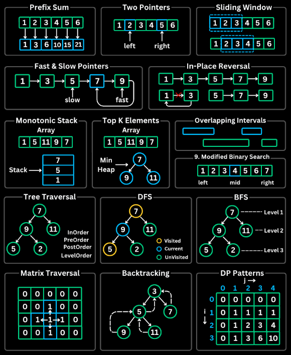

### Content
1. [Prefix Sum](#1-prefix-sum)
2. [Two Pointers](#2-two-pointers)
3. [Sliding Window](#3-sliding-window)
4. [Fast & Slow Pointers](#4-fast--slow-pointers)
5. [LinkedList In-place Reversal](#5-linkedlist-in-place-reversal)
6. [Frequency Counting](#6-frequency-counting)
7. [Monotonic Stack](#7-monotonic-stack)
8. [Bit Manipulation](#8-bit-manipulation)
9. [Top ‘K’ Elements](#9-top-k-elements)
10. [Overlapping Intervals](#10-overlapping-intervals)
11. [Modified Binary Search](#11-modified-binary-search)
12. [Binary Tree Traversal](#12-binary-tree-traversal)
13. [Depth-First Search (DFS)](#13-depth-first-search-dfs)
14. [Breadth-First Search (BFS)](#14-breadth-first-search-bfs)
15. [Shortest Path](#15-shortest-path)
16. [Matrix Traversal](#16-matrix-traversal)
17. [Backtracking](#17-backtracking)
18. [Prefix Search (Trie)](#18-prefix-search-trie)
19. [Greedy](#19-greedy)
20. [Dynamic Programming Patterns](#20-dynamic-programming-patterns)

### 1. PreFix Sum

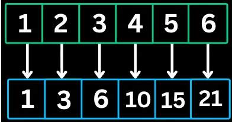
- The Prefix Sum pattern involves preprocessing an array to create a new array where each element at index i represents the sum of all elements from the start up to i. This allows for O(1) sum queries on any subarray.

```java
// Build prefix sum array
int[] prefix = new int[n + 1];
for (int i = 0; i < n; i++) {
    prefix[i + 1] = prefix[i] + nums[i];
}

// Query sum of range [left, right]
int rangeSum = prefix[right + 1] - prefix[left];
```

**When to use**
- Multiple sum queries on subarrays
- Finding subarrays with a target sum
- Calculating cumulative totals

**Practice Problems**
- Range Sum Query - Immutable (LeetCode #303)
- Contiguous Array (LeetCode #525)
- Subarray Sum Equals K (LeetCode #560)
- Product of Array Except Self (LeetCode #238)


### 2. Two Pointers
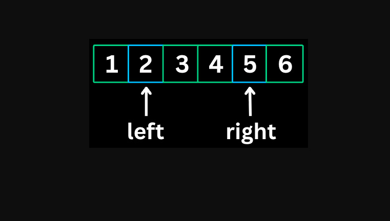
- The Two Pointers pattern uses two pointers to traverse an array or list, typically from opposite ends or both moving in the same direction. 
- It reduces time complexity from O(n^2) to O(n) for many problems.

```java
    // Opposite direction (converging)
int left = 0, right = n - 1;
while (left < right) {
    if (condition_met) {
        // found answer
    } else if (need_larger_sum) {
        left++;
    } else {
        right--;
    }
}
```
```java
// Same direction
int slow = 0;
for (int fast = 0; fast < n; fast++) {
    if (condition) {
        // process and move slow
        slow++;
    }
}
```

**When to use**
1. Finding pairs in sorted arrays
2. Comparing elements from both ends
3. Partitioning arrays
4. Palindrome checks

**Practice Problems**
* Two Sum II - Input Array is Sorted (LeetCode #167)
* 3Sum (LeetCode #15)
* Container With Most Water (LeetCode #11)
* Trapping Rain Water (LeetCode #42)
* Valid Palindrome (LeetCode #125)


### 3. Sliding Window
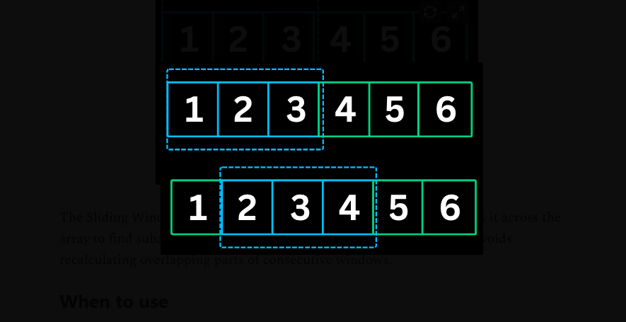
- The Sliding Window pattern maintains a window of elements and slides it across the array to find subarrays or substrings that satisfy certain conditions. 
- It avoids recalculating overlapping parts of consecutive windows.

```java
    // Fixed-size window
int windowSum = 0;
for (int i = 0; i < n; i++) {
    windowSum += nums[i];
    if (i >= k - 1) {
        // process window
        result = Math.max(result, windowSum);
        windowSum -= nums[i - k + 1];
    }
}
```
```java
// Variable-size window
int left = 0;
for (int right = 0; right < n; right++) {
    // expand window by including nums[right]

    while (window_condition_violated) {
        // shrink window from left
        left++;
    }

    // update result
}
```

**When to use**
* Contiguous subarray/substring problems
* Finding maximum/minimum in window of size k
* Longest/shortest substring with certain properties
* Problems involving consecutive elements

**Practice Problems**
1. Maximum Average Subarray I (LeetCode #643)
2. Longest Substring Without Repeating Characters (LeetCode #3)
3. Minimum Window Substring (LeetCode #76)
4. Permutation in String (LeetCode #567)
5. Sliding Window Maximum (LeetCode #239)

### 4. Fast & Slow Pointers
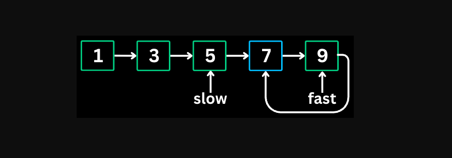
- The Fast & Slow Pointers pattern (also called Tortoise and Hare) uses two pointers moving at different speeds. 
- When there is a cycle, the fast pointer will eventually meet the slow pointer.

```java
// Find middle
while (fast != null && fast.next != null) {
    slow = slow.next;
    fast = fast.next.next;
}
return slow; // middle node
```

```java
// Cycle detection
ListNode slow = head, fast = head;
while (fast != null && fast.next != null) {
    slow = slow.next;
    fast = fast.next.next;

    if (slow == fast) {
        // cycle detected
        return true;
    }
}
return false; // no cycle
```
**When to use**
* Detecting cycles in linked lists or arrays
* Finding the middle of a linked list
* Finding the start of a cycle

**Practice Problems**
1. Linked List Cycle (LeetCode #141)
2. Linked List Cycle II (LeetCode #142)
3. Happy Number (LeetCode #202)
4. Find the Duplicate Number (LeetCode #287)
5. Middle of the Linked List (LeetCode #876)

### 5. LinkedList In-place Reversal
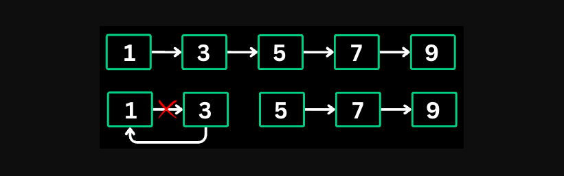
- This pattern reverses parts of a linked list without using extra space. 
- It manipulates pointers to reverse the direction of links.

```Java
    // Reverse entire list
    ListNode prev = null, curr = head;
    while (curr != null) {
        ListNode next = curr.next;
        curr.next = prev;
        prev = curr;
        curr = next;
    }
    // new head
    return prev; 
```

**When to use**
* Reversing a linked list or portion of it
* Reversing nodes in groups
* Checking for palindromes in linked lists

**Practice Problems**
1. Reverse Linked List (LeetCode #206)
2. Reverse Linked List II (LeetCode #92)
3. Swap Nodes in Pairs (LeetCode #24)
4. Reverse Nodes in k-Group (LeetCode #25)
5. Palindrome Linked List (LeetCode #234)

### 6. Frequency Counting
- The Frequency Counting pattern uses hash maps or arrays to count occurrences of elements. 
- It transforms O(n^2) lookup problems into O(n) by trading space for time.

```java
// Using HashMap
Map<Integer, Integer> freq = new HashMap<>();
for (int num : nums) {
    freq.put(num, freq.getOrDefault(num, 0) + 1);
}

// Using array (when range is known)
int[] freq = new int[26]; // for lowercase letters
for (char c : str.toCharArray()) {
    freq[c - 'a']++;
}

// Finding element with specific frequency
for (Map.Entry<Integer, Integer> entry : freq.entrySet()) {
    if (entry.getValue() == target) {
        return entry.getKey();
    }
}
```


**When to use**
* Finding duplicates or unique elements
* Checking if two collections have same elements
* Finding elements that appear k times
* Anagram problems

**Practice Problems**
1. Valid Anagram (LeetCode #242)
2. Group Anagrams (LeetCode #49)
3. Top K Frequent Elements (LeetCode #347)
4. First Unique Character in a String (LeetCode #387)

### 7. Monotonic Stack
- A Monotonic Stack maintains elements in either increasing or decreasing order. 
- As you iterate, you pop elements that violate the order, which reveals relationships between elements.

```java
/// Next Greater Element (decreasing stack)
int[] result = new int[n];
Arrays.fill(result, -1);
Stack<Integer> stack = new Stack<>(); // stores indices

for (int i = 0; i < n; i++) {
    while (!stack.isEmpty() && nums[i] > nums[stack.peek()]) {
        int idx = stack.pop();
        result[idx] = nums[i];
    }
    stack.push(i);
}
```

**When to use**
* Finding the next greater/smaller element
* Finding previous greater/smaller element
* Problems involving spans or ranges
* Histogram problems

**Practice Problems**
1. Next Greater Element I (LeetCode #496)
2. Daily Temperatures (LeetCode #739)
3. Largest Rectangle in Histogram (LeetCode #84)
4. Trapping Rain Water (LeetCode #42)
5. Online Stock Span (LeetCode #901)

### 8. Bit Manipulation
- Bit manipulation uses binary operations (AND, OR, XOR, NOT, shifts) to solve problems efficiently.
- XOR is particularly useful since a ^ a = 0 and a ^ 0 = a.

```java
// Basic operations
int and = a & b;        // both bits 1
int or = a | b;         // either bit 1
int xor = a ^ b;        // bits different
int not = ~a;           // flip bits
int leftShift = a << n; // multiply by 2^n
int rightShift = a >> n;// divide by 2^n
```

```java
// Check if bit i is set
boolean isSet = (n & (1 << i)) != 0;
```
```java
// Set bit i
n = n | (1 << i);
```
```java
// Clear bit i
n = n & ~(1 << i);
```
```java
// Toggle bit i
n = n ^ (1 << i);
```
```java
// Check if power of 2
boolean isPowerOf2 = (n > 0) && ((n & (n - 1)) == 0);
```

```java
// Count set bits
int count = 0;
while (n > 0) {
    count += n & 1;
    n >>= 1;
}
// Or: Integer.bitCount(n);
```

```java
// Find single number (XOR all elements)
int single = 0;
for (int num : nums) {
    single ^= num;
}
```

**When to use**
* Finding unique numbers (XOR)
* Checking power of 2
* Counting bits
* Generating subsets using bit masks
* Space optimization


**Practice Problems**
1. Single Number (LeetCode #136)
2. Number of 1 Bits (LeetCode #191)
3. Counting Bits (LeetCode #338)
4. Power of Two (LeetCode #231)
5. Missing Number (LeetCode #268)

### 9. Top ‘K’ Elements
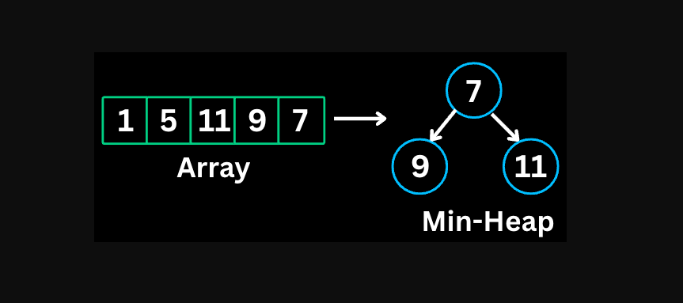
- This pattern finds the k largest or smallest elements using heaps (priority queues).
- A min-heap of size k keeps track of k largest elements, and a max-heap keeps k smallest.

```java
// K largest elements using min-heap
PriorityQueue<Integer> minHeap = new PriorityQueue<>();

for (int num : nums) {
    minHeap.offer(num);
    if (minHeap.size() > k) {
        minHeap.poll(); // remove smallest
    }
}
// minHeap now contains k largest elements
// minHeap.peek() is the kth largest
```
**When to use**
* Finding k largest/smallest elements
* Finding kth largest/smallest element
* Finding k most/least frequent elements
* Merging k sorted lists

**Practice Problems**
1. Kth Largest Element in an Array (LeetCode #215)
2. Top K Frequent Elements (LeetCode #347)
3. K Closest Points to Origin (LeetCode #973)
4. Find K Pairs with Smallest Sums (LeetCode #373)
5. Kth Largest Element in a Stream (LeetCode #703)

### 10. Overlapping Intervals
- This pattern handles problems involving intervals that may overlap.
- The key insight is that after sorting by start time, two intervals [a, b] and [c, d] overlap if b >= c.

```java
// Sort by start time
Arrays.sort(intervals, (a, b) -> a[0] - b[0]);

// Merge overlapping intervals
List<int[]> merged = new ArrayList<>();
for (int[] interval : intervals) {
    if (merged.isEmpty() || merged.get(merged.size() - 1)[1] < interval[0]) {
        // no overlap, add new interval
        merged.add(interval);
    } else {
        // overlap, merge by extending end time
        merged.get(merged.size() - 1)[1] =
            Math.max(merged.get(merged.size() - 1)[1], interval[1]);
    }
}
```

**When to use**
* Merging overlapping intervals
* Finding interval intersections
* Scheduling problems (meeting rooms)
* Inserting into sorted intervals

**Practice Problems**
1. Merge Intervals (LeetCode #56)
2. Insert Interval (LeetCode #57)
3. Non-overlapping Intervals (LeetCode #435)
4. Meeting Rooms (LeetCode #252)
5. Meeting Rooms II (LeetCode #253)

### 11. Modified Binary Search
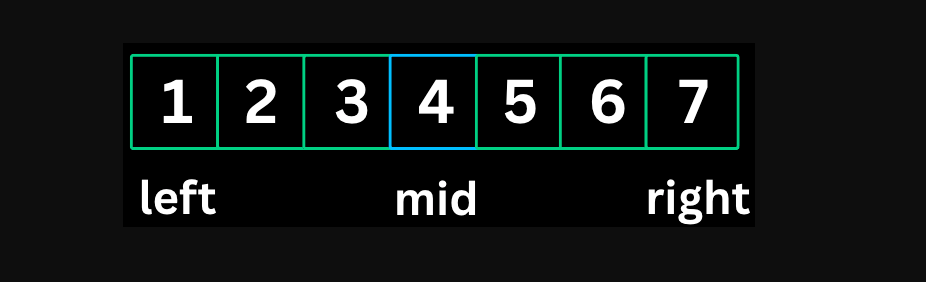
- This pattern adapts binary search to handle rotated arrays, finding boundaries, or searching for conditions rather than exact values.

```java
// Standard binary search
int left = 0, right = n - 1;
while (left <= right) {
    int mid = left + (right - left) / 2;
    if (nums[mid] == target) return mid;
    else if (nums[mid] < target) left = mid + 1;
    else right = mid - 1;
}
```
```java
// Find first occurrence
while (left < right) {
    int mid = left + (right - left) / 2;
    if (condition(mid)) right = mid;
    else left = mid + 1;
}
```

**When to use**
* Searching in rotated sorted arrays
* Finding first/last occurrence of element
* Finding minimum/maximum satisfying a condition
* Peak finding problems

**Practice Problems**
1. Search in Rotated Sorted Array (LeetCode #33)
2. Find Minimum in Rotated Sorted Array (LeetCode #153)
3. Search a 2D Matrix (LeetCode #74)
4. Find Peak Element (LeetCode #162)
5. First Bad Version (LeetCode #278)

### 12. Binary Tree Traversal
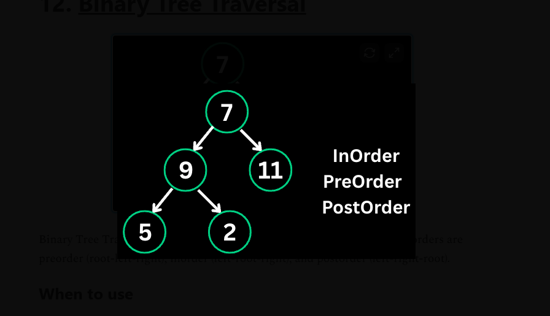
- Binary Tree Traversal visits all nodes in a specific order. 
- The three main orders are preorder (root-left-right), inorder (left-root-right), and postorder (left-right-root).

```java
// Preorder (Root -> Left -> Right)
void preorder(TreeNode node) {
    if (node == null) return;
    process(node);        // visit root
    preorder(node.left);  // left subtree
    preorder(node.right); // right subtree
}
```
```java
// Inorder (Left -> Root -> Right)
void inorder(TreeNode node) {
    if (node == null) return;
    inorder(node.left);   // left subtree
    process(node);        // visit root
    inorder(node.right);  // right subtree
}
```
```java
// Postorder (Left -> Right -> Root)
void postorder(TreeNode node) {
    if (node == null) return;
    postorder(node.left);  // left subtree
    postorder(node.right); // right subtree
    process(node);         // visit root
}
```
**When to use**
* Processing tree nodes in specific order
* Building trees from traversals
* BST operations (inorder gives sorted order)
* Tree serialization/deserialization

**Practice Problems**
1. Binary Tree Inorder Traversal (LeetCode #94)
2. Binary Tree Preorder Traversal (LeetCode #144)
3. Binary Tree Postorder Traversal (LeetCode #145)
4. Kth Smallest Element in a BST (LeetCode #230)
5. Validate Binary Search Tree (LeetCode #98)

### 13. Depth-First Search (DFS)
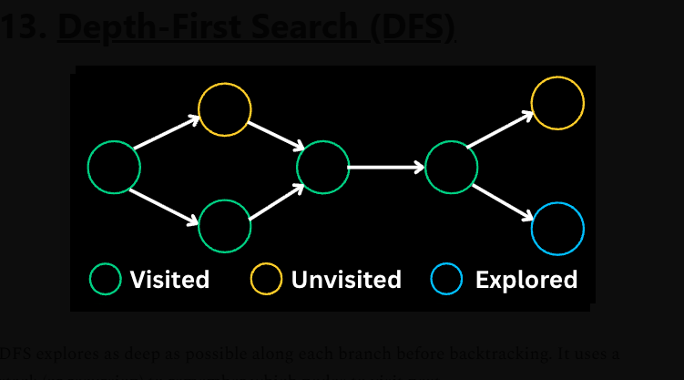
- DFS explores as deep as possible along each branch before backtracking. 
- It uses a stack (or recursion) to remember which nodes to visit next.

```java
// DFS on a graph - visited tracking required
void dfs(int node, boolean[] visited, List<List<Integer>> graph) {
    visited[node] = true;

    // Process current node
    process(node);

    // Explore unvisited neighbors
    for (int neighbor : graph.get(node)) {
        if (!visited[neighbor]) {
            dfs(neighbor, visited, graph);
        }
    }
}
```

**When to use**
* Exploring all paths in a tree/graph
* Finding connected components
* Detecting cycles
* Topological sorting
* Path finding when all paths matter

**Practice Problems**
1. Path Sum (LeetCode #112)
2. Path Sum II (LeetCode #113)
3. Clone Graph (LeetCode #133)
4. Course Schedule II (LeetCode #210)
5. Number of Islands (LeetCode #200)

### 14. Breadth-First Search (BFS)
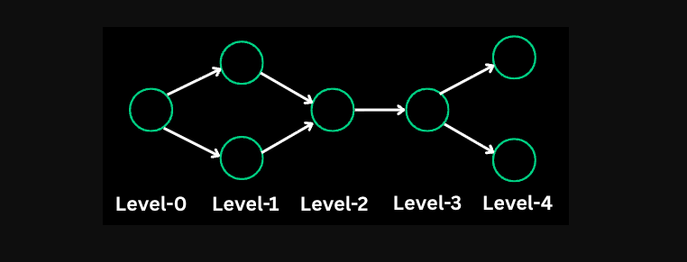
- BFS explores nodes level by level, visiting all neighbors before moving deeper. 
- It uses a queue and guarantees the shortest path in unweighted graphs.

```java
public void bfs(Node start) {
    // Handle edge case
    if (start == null) return;

    // Initialize queue and visited set
    Queue<Node> queue = new LinkedList<>();
    Set<Node> visited = new HashSet<>();

    // Add starting node
    queue.offer(start);
    visited.add(start);

    // Process nodes level by level
    while (!queue.isEmpty()) {
        Node current = queue.poll();

        // Process the current node
        process(current);

        // Add unvisited neighbors to queue
        for (Node neighbor : current.getNeighbors()) {
            if (!visited.contains(neighbor)) {
                visited.add(neighbor);
                queue.offer(neighbor);
            }
        }
    }
}
```

**When to use**
* Finding shortest path (unweighted)
* Level-order traversal
* Finding all nodes at distance k
* Spreading problems (rotting oranges, walls and gates)

**Practice Problems**
1. Binary Tree Level Order Traversal (LeetCode #102)
2. Rotting Oranges (LeetCode #994)
3. Word Ladder (LeetCode #127)
4. Minimum Depth of Binary Tree (LeetCode #111)
5. Walls and Gates (LeetCode #286)

### 15. Shortest Path
### 16. Matrix Traversal
### 17. Backtracking
### 18. Prefix Search (Trie)
### 19. Greedy
### 20. Dynamic Programming Patterns