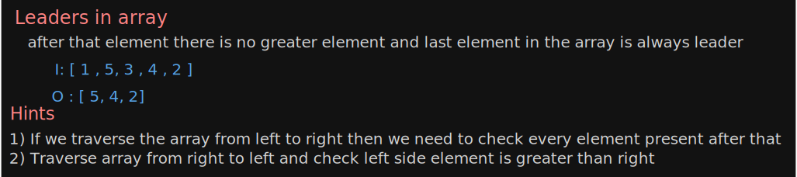
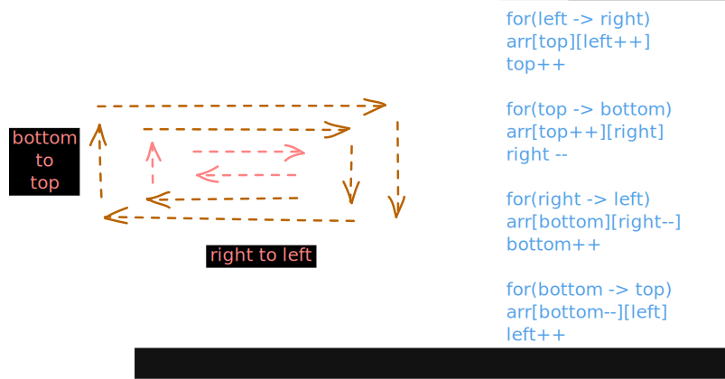
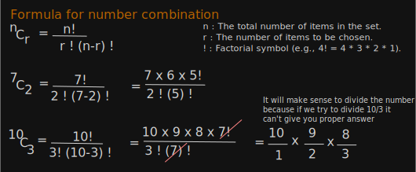

# Solutions

### LeaderInArray

### Re-Arrange Array Element by sign

### PrintTheMatrixInSpiralManner

#### Pascal Traingle

#### I Q. Given two integers r and c, return the value at the rth row and cth column (1-indexed) in a Pascal's Triangle.
1) **Approach 1 :** A brute force way to solve this will be to generate the entire Pascal's Triangle up to the given row number and then return the element at the given position.
2) **Approach 2 :** nCr (number of combinations)

- n : The total number of items in the set. 
- r : The number of items to be chosen.
- ! : Factorial symbol (e.g., 4! = 4 * 3 * 2 * 1).

#### II Q. Given an integer r, return all the values in the rth row (1-indexed) in Pascal's Triangle in correct order.
