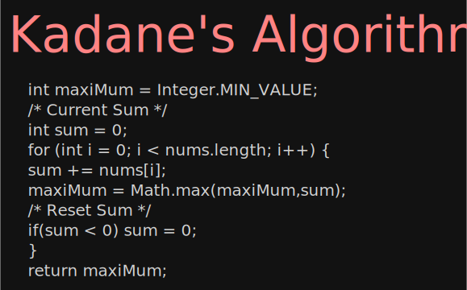

# Kadane's Algorithm

- Kadane's algorithm is an efficient, greedy/dynamic programming algorithm used to find the maximum sum of a contiguous subarray within a one-dimensional array of numbers.
****

### Before Kadane's algorithm
- Normally to calculate maximum sum of sub array we refer 2 loops
- 1'st loop to get start index of sub array
- 2'nd loop to start from start index and add one by one  next element until we reach to last index
- In 2'nd loop we are performing sum operation to get maximum_sum of that sub array
- But its take time of O(n^2)

###  After Kadane's algorithm 
- We are using single loop to iterate over the array.
- Along with we kept currSum value to calculate next sum value
- currSum += next element
- then we check for maxiMum value with currSum
- if sum < 0 then we do sum = 0 because whatever we add at less than zero most probably that sum value become < 0 so we avoid that negative value

