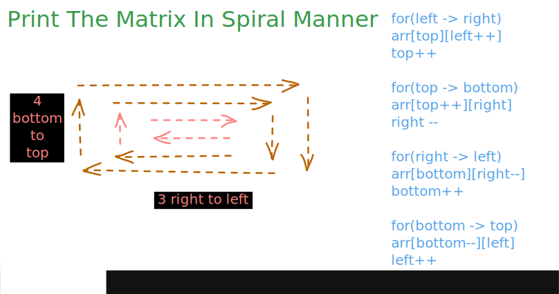
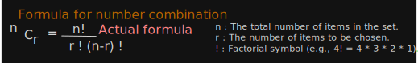
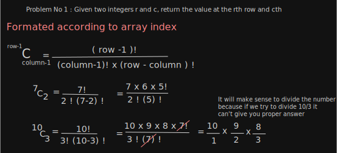
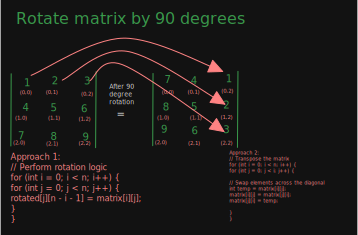

# Solutions

### LeaderInArray


### Re-Arrange Array Element by sign


### PrintTheMatrixInSpiralManner



#### Pascal Traingle



#### I Q. Given two integers r and c, return the value at the rth row and cth column (1-indexed) in a Pascal's Triangle.
1) **Approach 1 :** A brute force way to solve this will be to generate the entire Pascal's Triangle up to the given row number and then return the element at the given position.
2) **Approach 2 :** nCr (number of combinations)


#### II Q. Given an integer r, return all the values in the rth row (1-indexed) in Pascal's Triangle in correct order.


#### III Q. Given an integer n, return the first n (1-Indexed) rows of Pascal's triangle.


#### 90 Degree Rotation Matrix


### Two Sum 
**Q. Given an array of integers nums and an integer target. Return the indices(0 - indexed) of two elements in nums such that they add up to target.**
```java
int[] nums = {2, 6, 5, 8, 11};
int target = 14;
// Result : [1, 3];
```
1) **Approach 1:** Brute Force with two for loops
   - 1st loop for select an element
   - 2nd loop to iterate over remaining part of array
   - sum of 1st loop element and 2nd loop element is equal to target then return index of both
2) **Approach 2:** Using HashMap 
   - to reduce search space we use HashMap
   - Loop is for selecting an element
   - after selecting an element reduce that value from target
   - after reducing the value from taget check that value as key of hashmap present or not
   - if yes print the array with (hashMap_value, currentIndex)
   - if not put that in map as (elementAsKey, indexAsValue)
3) **Approach 3:** Using 2D array
    - Without hashmap.
    - we use 2D array to store element with their index value.
    - Sort 2D array based on index
    - using two pointer (left and right pointer) we iterate over the array to find the sum
    - if sum > target reduce right--
    - if sum < target increase left ++

### 3 Sum
Q. Given an integer array nums. Return all triplets such that:
```
   i != j, i != k, and j != k
   nums[i] + nums[j] + nums[k] == 0.
   
   Example 1
   Input: nums = [2, -2, 0, 3, -3, 5]
   Output: [[-2, 0, 2], [-3, -2, 5], [-3, 0, 3]]
   Explanation:
   nums[1] + nums[2] + nums[0] = 0
   nums[4] + nums[1] + nums[5] = 0
   nums[4] + nums[2] + nums[3] = 0
```
**Approach 1 :** Brute force (With the help of 3 nested loops)

**Approach 2 :** Better (With the help of 2 nested loops + Hashing)
1) 1st loop to select an element **a** and 2nd loop **b** to iterate over the remaining element of the array 
2) Calculate the third number **c** logic 
  ``` 
a + b + c = 0
 a + b = - c
 c = - ( a + b)
```
3) After calculating the third number check that element present in hash or not
4) If yes then sum == 0 and add that 3 value after sorting to result list.
5) if not then store **b** element  to hash for further process.

**Approach 3 :** Optimal (Sorting + Outer loop + Two Pointer )
1) First Sort the array
2) First loop to select start element i.e. first pointer **i**
3) We use two pointer for middle **j** and last **k**  
4) if sum > 0 then last pointer **k** should reduce
5) if sum < 0 then middle pointer **j** should increase
6) if sum == 0 then it's a Three Sum
   - then increase middle pointer **j++**
   - and reduce decrease last pointer **k--**
   - if there is duplicate value middle pointer then **j++** 
   - if there is duplicate value last pointer then **k--** 

### Four Sum
**Q. Given an integer array nums and an integer target. Return all quadruplets [nums[a], nums[b], nums[c], nums[d]] such that:**
- a, b, c, d are all distinct valid indices of nums. 
- nums[a] + nums[b] + nums[c] + nums[d] == target.

```
Example 1

Input: nums = [1, -2, 3, 5, 7, 9], target = 7
Output: [[-2, 1, 3, 5]]
Explanation: nums[1] + nums[0] + nums[2] + nums[3] = 7

Example 2

Input: nums = [7, -7, 1, 2, 14, 3], target = 9
Output: []
Explanation: No quadruplets are present which add upto 9
```

**Approach 1 (BruteForce) :** TC(n^4)   
- Used four loop to find the target and return index on element that after finding that target

**Approach 2 (Better) :** TC(n^3)
- Reduce search time by one by using hashing concept
- In brute force approach we are use 4 loop but in this concept we are going to use 3 loops.
- Before iterating 3rd loop, we declare hashing concept to store and get the fourth value.
- We sum the three value and subtract that sum  from target to get the fourth value ( concept we use two sum approach)
- If fourth value available in hashing then we got the sum of quadrants.
- we are going to use 3rd loop value as hashed.

``` 
a + b + c + d = target
 a + b + c  - target = - d 
d = target - ( a + b + c)

```

**Approach 3 (Optimal) :** 
- Reduce search time and space by using two pointer concept.
- We sort the array for traversing and using two pointer concept.
- 2 for loop for regular and after that we used concept like two pointer.


### Dutch National Flag
**Q. Given an array nums consisting of only 0, 1, or 2. Sort the array in non-decreasing order.**

```
Example 1

Input: nums = [1, 0, 2, 1, 0]
Output: [0, 0, 1, 1, 2]
Explanation: The nums array in sorted order has 2 zeroes, 2 ones and 1 two

Example 2

Input: nums = [0, 0, 1, 1, 1]
Output: [0, 0, 1, 1, 1]
Explanation: The nums array in sorted order has 2 zeroes, 3 ones and zero twos

```

**Approach 1 ( Brute Force Approach ) :**
- Create 3 Arrays for 0, 1, 2
- Add the respective value in their respective array i.e. 0 value to 0 based array
- Add 1st 0 array to result list then 1 and 2.

**Approach 2 (Dutch National Flag)**
- With the help of 2 pointer


### Maximum Sum from SubArray  ( Kadane Algorithms )

- [Kadane's Algorithms](Kadanes_Algorithm.md)