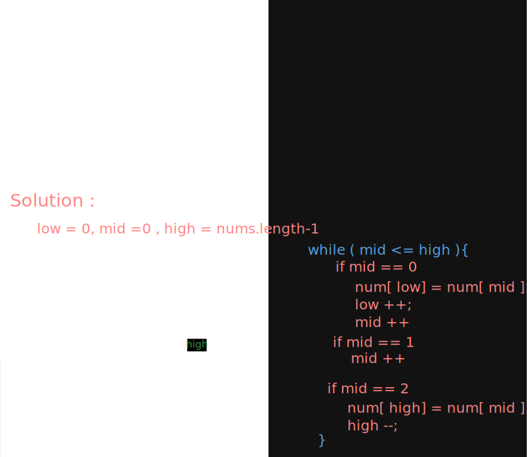
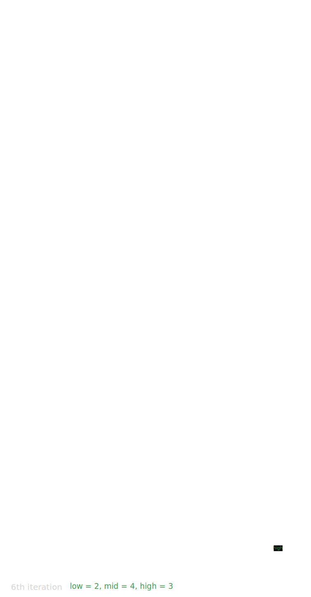

# Dutch National Flag ( Red, Green, Blue)

This algorithm **contains 3 pointers** i.e. low, mid, and high, and 3 main rules.
- Index 0 to low -1 contains 0
- Index low to mid - 1 contains 1
- Index high +1 to sizeOfArray - 1 contains 2.

**Q. Why we are not changing mid index while num [mid]== 2?**
- We are performing this action on mid index
- While iteration our num [mid]== 2 but not num [high] != 2
- Before swapping we don't know at high index which value present
- After swapping that value comes at mid index so we need to validate their postion.
### How it works

## Related Question
1) https://leetcode.com/problems/sort-colors/description/