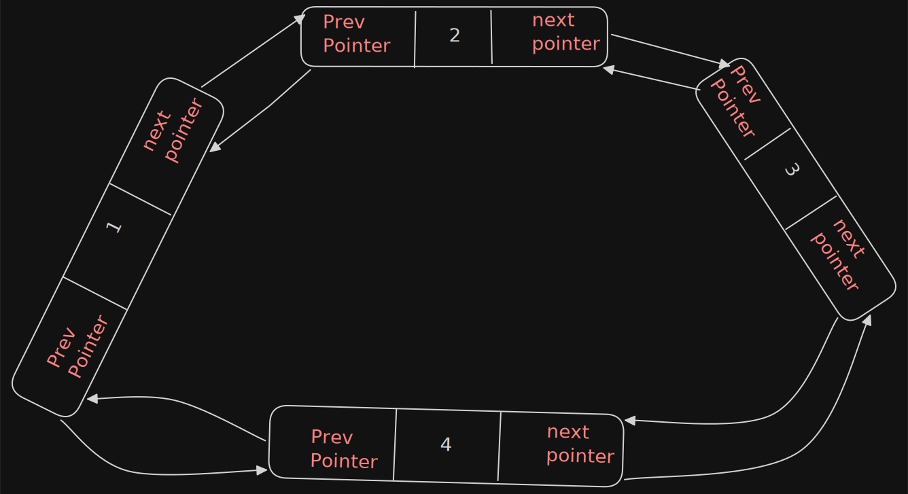
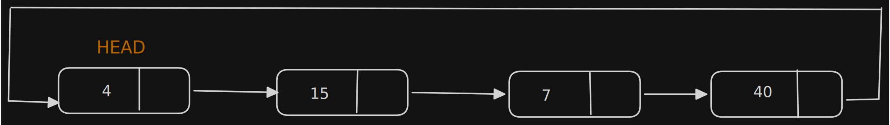
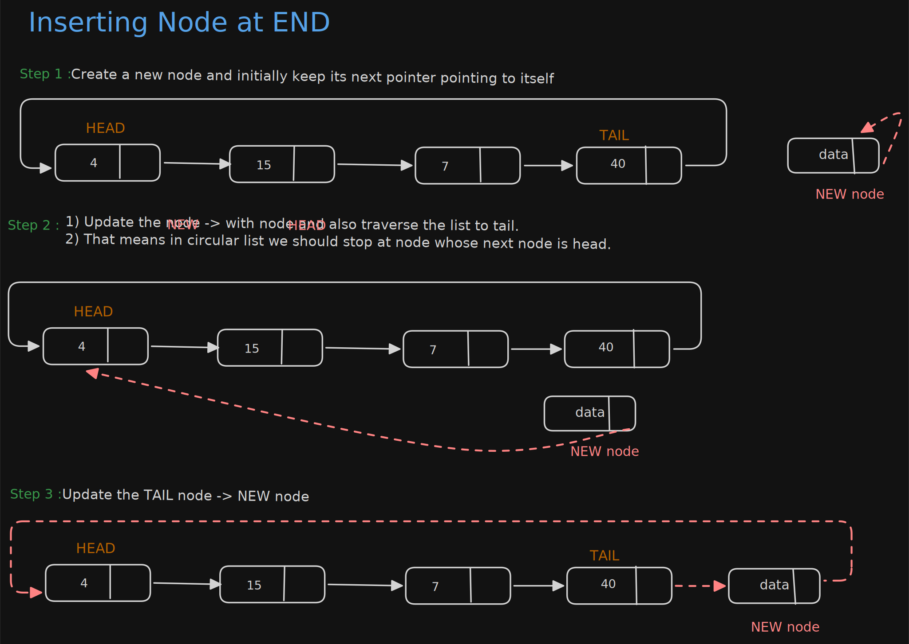
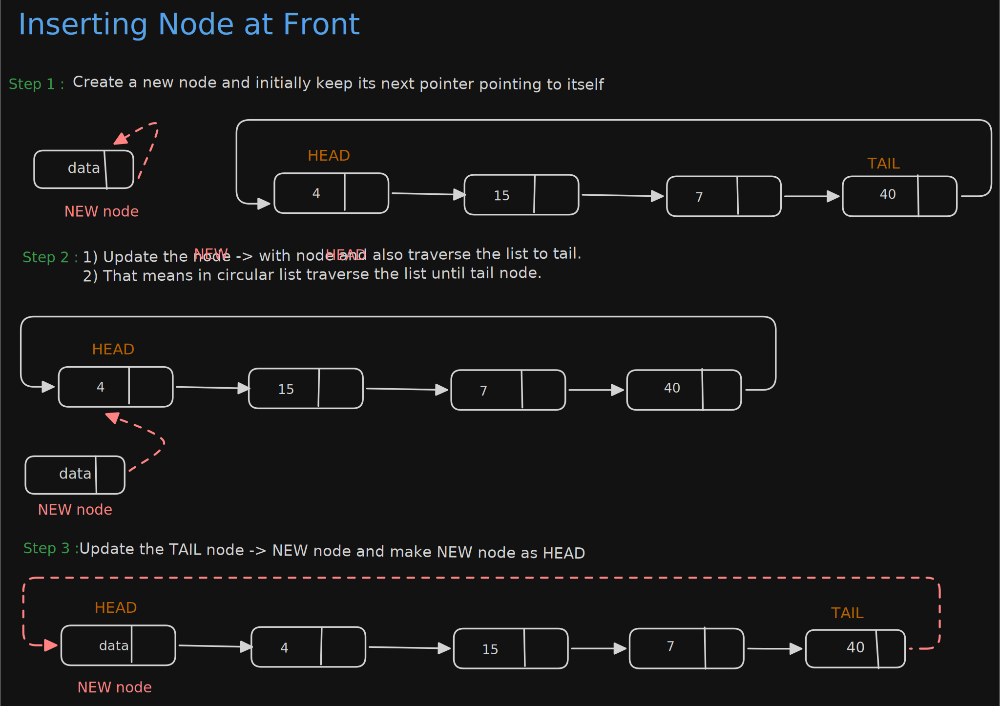
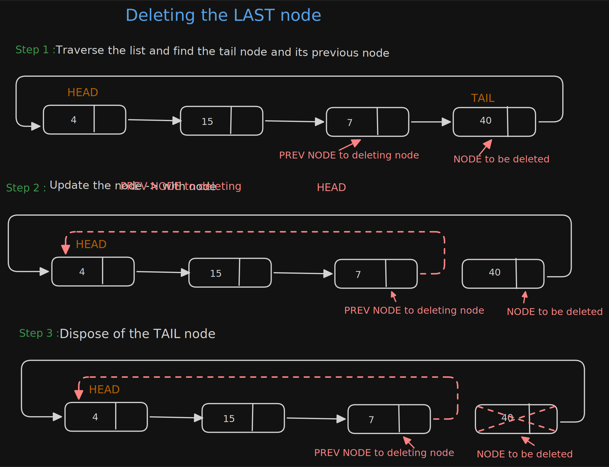
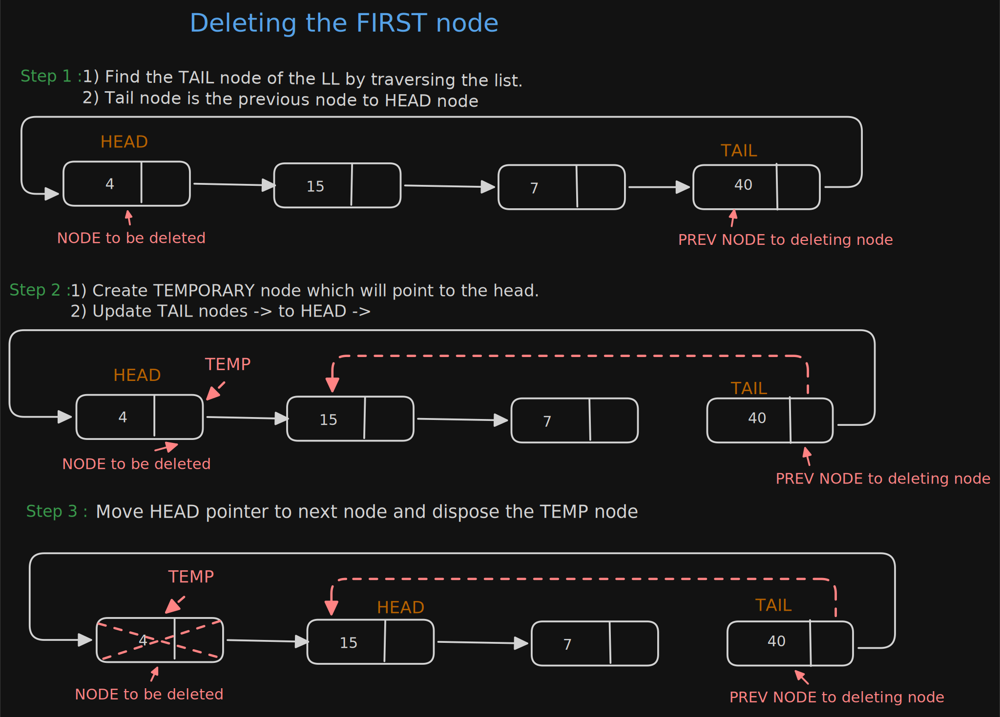

# Circular Linked List





- Singly and Doubly LL, the end of list are indicated with NULL value.
- But Circular Linked List do not have end
- While Traversing the Circular LL we should be careful otherwise we will be traversing the list infinitely,
- This LL, each node has successor

### Counting Nodes In Circular List
- It is accessible through node marked HEAD ( also called TAIL ).

```java
public  int countOfCircularLL(CLLNode tail){
    int length = 0;
    CLLNode currentNode = tail.next;
    while (currentNode != tail){
        length++;
        currentNode = currentNode.next;
    }
    return  length;
}
```

## Insertions

### Inserting NODE at the END
- The new node will be placed in between Tail and Head node.
  

### Inserting NODE at the FIRST




## Deletions

### Deleting NODE at the END



### Deleting NODE at the FIRST
