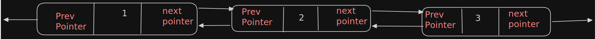
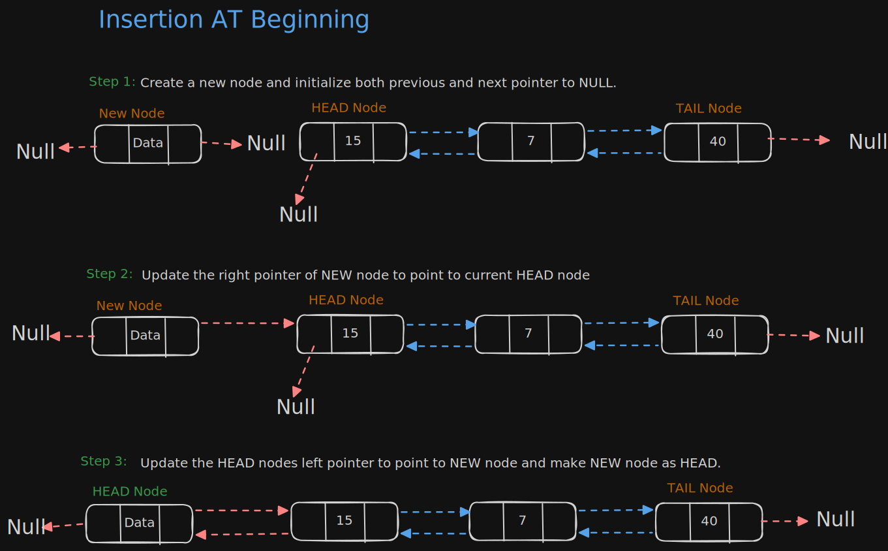
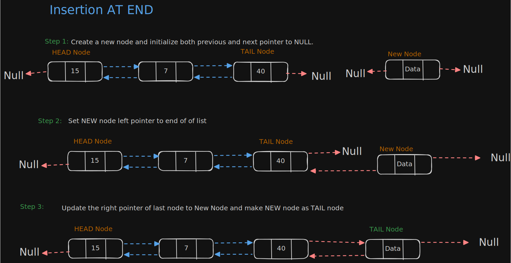
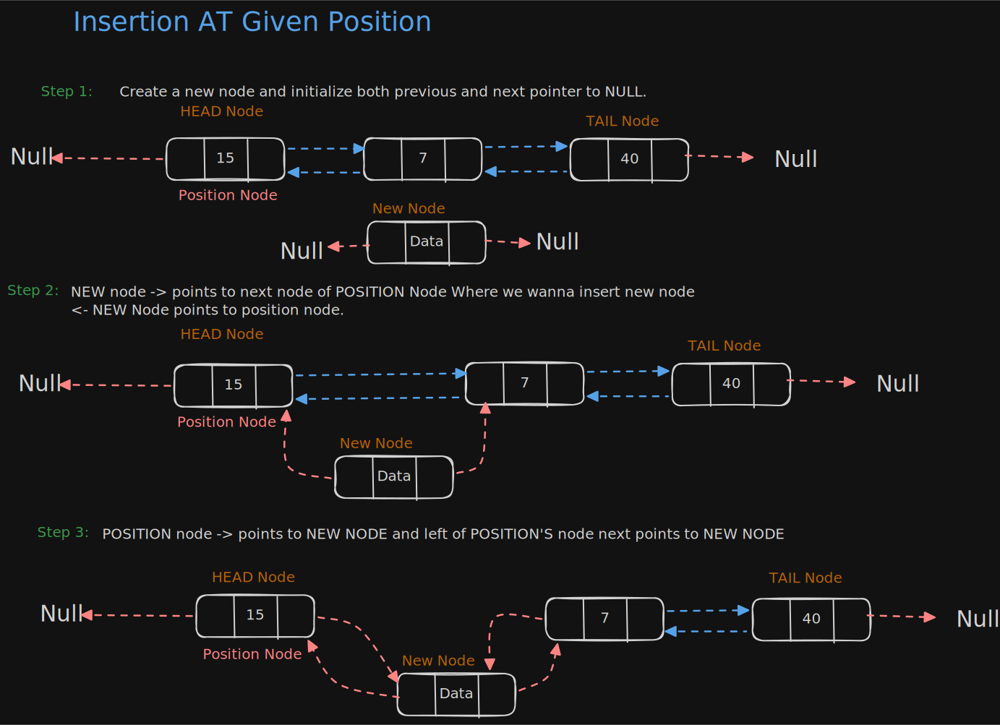
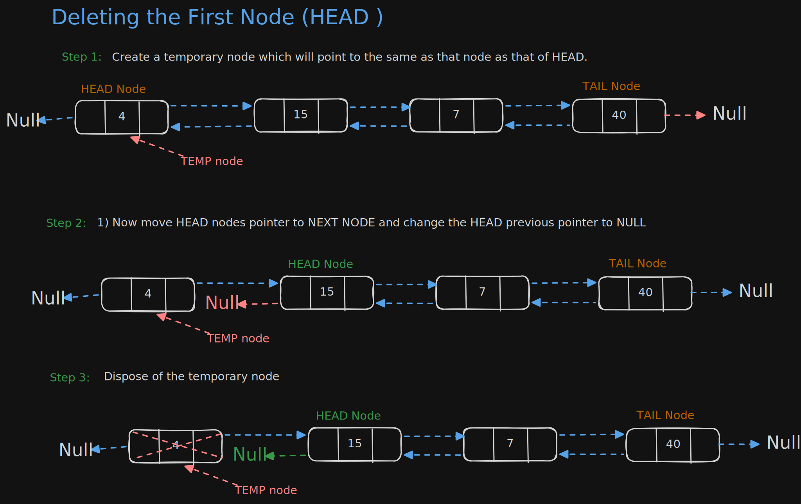
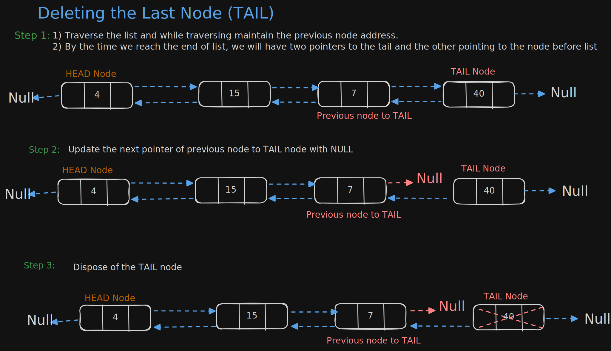
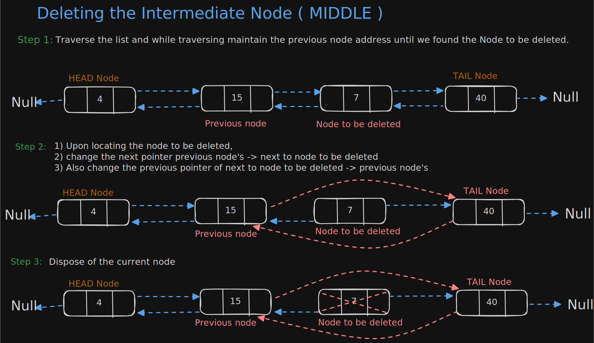

# Doubly Linked List

- Node contains a pointer to the previous as well as the next pointer in the sequence.
- It also called two-way linked list
- It's consist of 3 Parts
  - Data
  - Pointer to next node in sequence
  - Pointer to previous node in sequence
- HEAD node previous pointer point to NULL.
- TAIL node next pointer point to NULL.

**Advantage :**
- We can navigate in both direaction
- A node in singly linked list can't remove unless we have pointer to previous
- But in Doubly Linked list we can delete node even if we don't have the previous node address.

**Disadvantage :**
- Each node requires an extra pointer, requiring more space
- The insertion or deletion of node takes a bit longer ( more pointer operation). 

**[Doubly Linked List Implementation](../Problems/doubly_implementation/DoublyLinkedList.java)**

## Insertions
- Doubly Linked List has three cases
  - (Beginning) Inserting a new node before the head.
  - (Ending) Inserting a new node after the tail.
  - (Given position) Inserting a new node at middle of the list.

#### Inserting a node in Doubly Linked List at Beginning (Head Position)
- In this case new Node is inserted before the head
- Previous and Next pointer need to updated

#### Inserting a node in Doubly Linked List at End (TAIL Position)
- In this case Traverse the List till end and insert new Node.

#### Inserting a node in Doubly Linked List at Given Position (Middle Position)
- Traverse the list to the position node and insert new node. 

## Deletions
- Doubly Linked List has three cases
  - (Beginning) Deleting the first node (HEAD).
  - (Ending) Deleting the last node (TAIL).
  - (Given position) Deleting the intermediate node (MIDDLE).

#### Deleting the FIRST node (Head Position) in Doubly Linked List.

#### Deleting the Last node (TAIL Position) in Doubly Linked List.
- This operation bit trickier than removing the first node.
- Because algorithm should find a node which to the tail first.

#### Deleting the Intermediate node (Middle Position) in Doubly Linked List.
