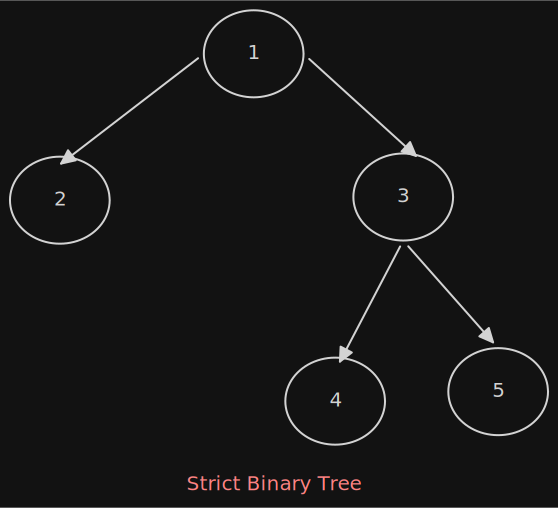

# Binary Tree
- If each node has zero child, one child or two child
- Empty tree is also valid binary tree

  

#### Types of binary tree
1) **Strict Binary Tree :** if each node has exactly two children or no children
   
2) **Full Binary Tree :** If each node has exactly two children and all leaf node are at same level
    - The number of nodes n in full binary tree is 2h+1 - 1
    - The number of leaf nodes in full binary tree is 2h
   
      
3) **Complete Binary Tree :** If all node are at hight h or h-1 and also without any missing number in the sequence.
    - The number of nodes n in complete binary tree is between 2h (Minimum) and 2h+1 -1 (Maximum)

  

### Structure of Binary tree
**[Binary Tree Structure](./BinaryTree/utility/TreeNode.java)**

### Operation on Binary Trees
1) **Basic Operations :**
    - Inserting an element into tree
    - Deleting an element into tree
    - Searching for an element
    - Traversing the tree
2) **Auxiliary Operation :**
    - Finding the size of the tree
    - Finding the height of the tree
    - Finding the level which has maximum sum
    - Finding the LCA (Least Common Ancestor)

### Binary Tree Traversal
- The process of visiting all nodes of tree is called traversal
- Each node is proessed only once but it may be visited more than once
- In linear data structure the elements are visited in sequential order but in tree structure there are many different way.
- All nodes are processed in the traversal but searching stops when the required node is found.

**Types of Traversal**
1) PRE-Order traversal
2) IN-Order traversal
3) POST-Order traversal
4) Level Order traversal

### PRE order traversal (DLR)
- visit the root
- traverse the left subtree in PPRE order
- traverse the right subtree in PRE order.

**[PRE Order Traversal Implementation](./BinaryTree/algorithm/PreOrderTraversal.java)**

### IN order traversal (LDR)

- traverse the left subtree in IN-order
- visit the root
- traverse the right subtree in IN-order.

**[IN Order Traversal Implementation](./BinaryTree/algorithm/InOrderTraversal.java)**

### IN order traversal (LDR)

- traverse the left subtree in POST-order
- traverse the right subtree in POST-order.
- visit the root

**[POST Order Traversal Implementation](./BinaryTree/algorithm/PostOrderTraversal.java)**