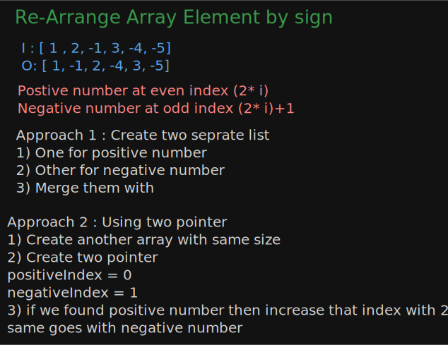
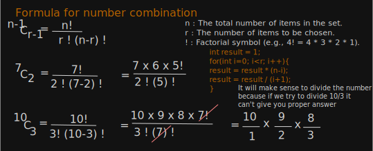
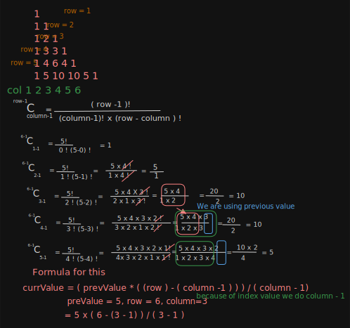

# Solutions

### LeaderInArray


### Re-Arrange Array Element by sign



### PrintTheMatrixInSpiralManner


#### Pascal Traingle



#### I Q. Given two integers r and c, return the value at the rth row and cth column (1-indexed) in a Pascal's Triangle.
1) **Approach 1 :** A brute force way to solve this will be to generate the entire Pascal's Triangle up to the given row number and then return the element at the given position.
2) **Approach 2 :** nCr (number of combinations)


#### II Q. Given an integer r, return all the values in the rth row (1-indexed) in Pascal's Triangle in correct order.


#### III Q. Given an integer n, return the first n (1-Indexed) rows of Pascal's triangle.


#### 90 Degree Rotation Matrix


#### Two Sum 
**Q. Given an array of integers nums and an integer target. Return the indices(0 - indexed) of two elements in nums such that they add up to target.**
```java
int[] nums = {2, 6, 5, 8, 11};
int target = 14;
// Result : [1, 3];
```
1) **Approach 1:** Brute Force with two for loops
   - 1st loop for select an element
   - 2nd loop to iterate over remaining part of array
   - sum of 1st loop element and 2nd loop element is equal to target then return index of both
2) **Approach 2:** Using HashMap 
   - to reduce search space we use HashMap
   - Loop is for selecting an element
   - after selecting an element reduce that value from target
   - after reducing the value from taget check that value as key of hashmap present or not
   - if yes print the array with (hashMap_value, currentIndex)
   - if not put that in map as (elementAsKey, indexAsValue)
3) **Approach 3:** Using 2D array
    - Without hashmap.
    - we use 2D array to store element with their index value.
    - Sort 2D array based on index
    - using two pointer (left and right pointer) we iterate over the array to find the sum
    - if sum > target reduce right--
    - if sum < target increase left ++


