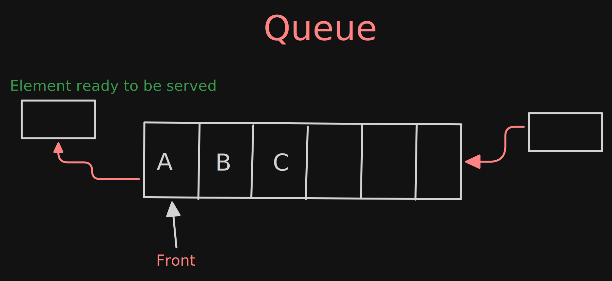
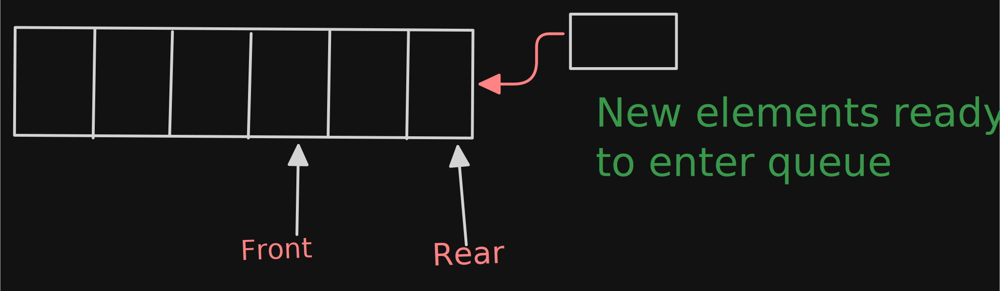
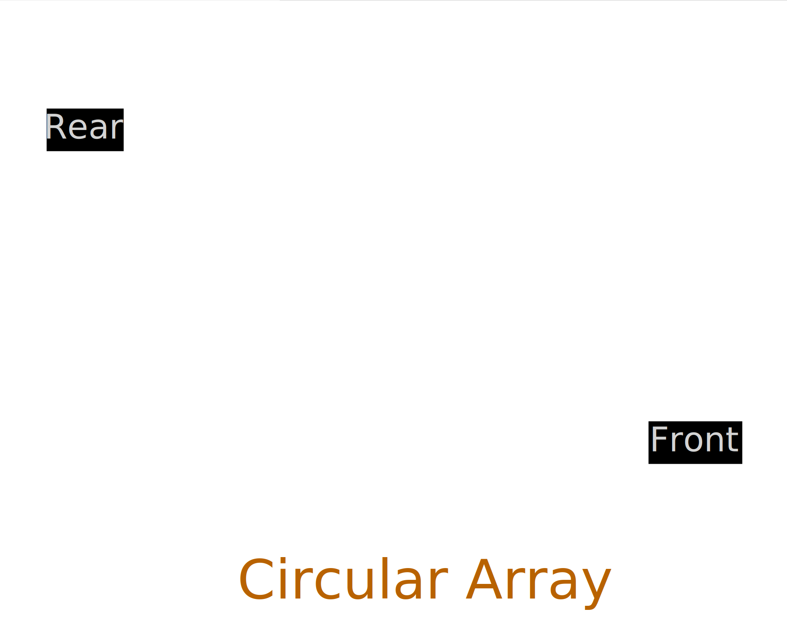
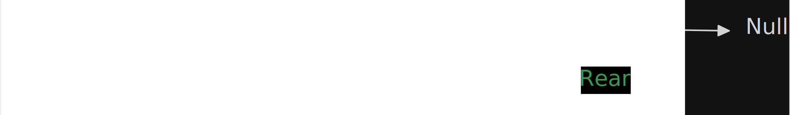

# Queue

- It's an order list in which insertion are done at one end (REAR) and deletion are done other end ( FRONT ).
- First one element to be inserted is the first one to be deleted 
  - Hences it called **FIFO (First In First Out)**

**Eg: Line at move ticket reservation**

**Operations**
- **EnQueue :** When element inserted in queue.
- **DeQueue :** When element removed from queue.
- **Underflow :**  DeQueueing an empty queue.
- **Overflow :** EnQueueing an full queue.

## ADT
- Main Queue Operation
  - void enQueue(int data) :: Insert the element at the end of the queue ( REAR).
  - int deQueue() :: delete the element from front of the queue.
- Auxiliary Queue Operation
  - int front() :: return the element from the front without removing.
  - int rear() :: return the element from the rear without removing.
  - int size() :: return the number of element stored in queue.
  - int isEmpty() :: Indicated queue has element or not .

## Exception
- Dequeue an empty queue throws "Empty queue Exception".
- Enqueue an full queue throws "Full Queue Exception".

## Applications
- Direct Application
  - Operating system schedule job (with equal priority) in the order of arrival.
  - Simulation of real world queue such as line at a ticket counter.
  - Multiprogramming.
  - Asynchronous data transfer (File IO, pipes, sockets).
  - Waiting time of customers at call center.
  - Determining number of cashiers to have at supermarket.
- Indirect Application
  - Auxiliary data structure of algorithms
  - Component of other data structure.

## Implementation
- Simple array based implementation
- Dynamic array based implementation
- Linked list implementation

## Why circular array ?
- After performing some insertion and deletion then you will understand below flow
- please consider below flow
  
- After performing some insertion and deletion operation the initial slot of array get wasted
- So simple array implementation is not enough to implement queue.
- To solve above problem we assume array as circular array.
- That means we treat last element and first element of array as contiguous.
- With this representation if there are any free slot at the beginning, th rear pointer can easily go its next free slot.

### Simple Circular Array Implementation

- We add elements circularly and **use two variable** to keep track of start & end elements.
- **Front** is used to indicate start elements.
- **Rear** is used to indicate last elements.
- With queue, however the two index field front and rear can only be increased by one.
- Front is increased by dequeue method.
- Rear is increased by enQueue method.
- **Wrap around** is technique is used with queue implemented with array
- When either the front or rear field is increased to point where it would index past the end of array it is set rear to 0
- Thus the state is reached where the **front index > rear index**

**Note :** initially both front and rear start at 0.

[Simple_Array_Based_Implementation](../Implementation/Simple_Array_Based_Implementation.java)

**Performance and Limitation :**
- Let n be the number of elements in QUEUE

| Operation                                 | TC |
|-------------------------------------------|-----|
| Space complexity ( for n push operation ) | O(n) |
| Time complexity for enQueue()             | O(1)|
| Time complexity for deQueue()             | O(1)|
| Time complexity for size()                | O(1)|
| Time complexity for isEmpty()             | O(1)|
| Time complexity for isFull()              | O(1)|

- Maximum size of queue must be defined as prior and cannot be changed.

### Dynamic Circular Array Implementation
- it is same as simple array implementation
[Dynamic_Array_Based_Implementation](../Implementation/Dynamic_Array_Based_Implementation.java)

### Linked List Implementation
- EnQueue operation is implemented by inserting an element at the end of list.
- DeQueue operation is implemented by deleting an element from beginning of list.

[Linked_List_Implementation_Queue](../Implementation/Linked_List_Implementation_Queue.java)