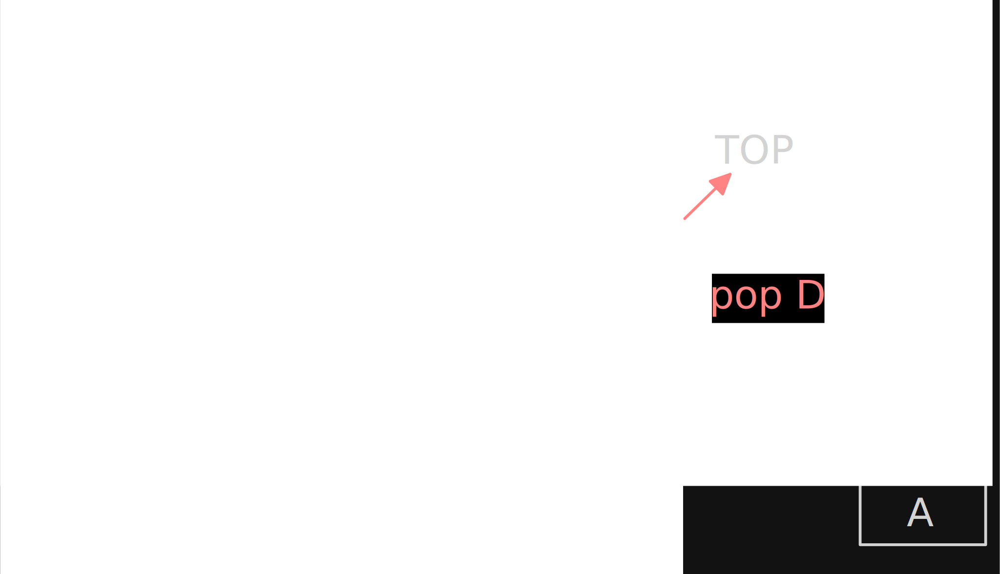
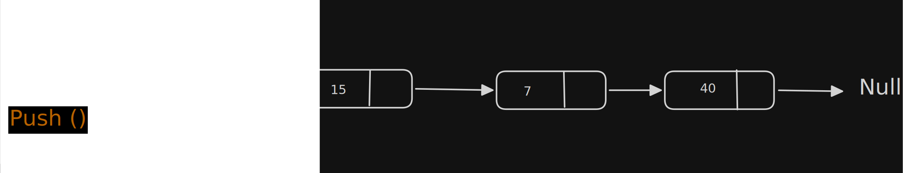

# Stack

- It is an ordered list in which insertion and deletion are done at one end called TOP.
- The last one inserted is the first one to be deleted.

**Operations :**
- **PUSH :** element inserted at stack.
- **POP :** elements are removed from stack.
- **Underflow :** trying to remove/POP  elements from empty stack.
- **Overflow :** trying to PUSH/insert out at full stack.

## Abstract Data Type 
- **Main Stack Operation**
  - void push(int data) :: insert data to stack.
  - int pop()  :: Removes and return  last inserted.
- **Auxiliary Stack Operation**
  - int top() :: returns last inserted  without  reasons.
  - int size() :: return no of element stored.
  - int isEmpty() :: any element  present  or not.
  - int isFull() :: Indicates full or not.

## Expectations 
- Performing an operation sometime cause an error.
- If operation can't perform then it should throw an error.
- If stack is empty then pop() and push() operation can't be executed.

## Applications
- In following operation stack play important role
- **Direct application :**
  - Balancing Symbols.
  - Infix to postfix conversion.
  - Evaluation of postfix expression.
  - Implementing function call (including recursion)
  - Finding span ( finding span in stock market)
  - Page visited history in web browser ( Back Buttons )
  - Undo sequence in a text editor
  - Matching tags in text editor
  - Matching tags in HTML and XML
- **Indirect Applications**
  - Auxiliary data structure  for other algorithms ( EX: Tree Traversal algorithms).
  - Component of Other data structure (EX : Simulating queues).

## Implementation 
- Simple Array Based
- Dynamic Array Based
- Linked List Implementation

### Simple Array Based
- In array, we add elements from left to right and we use variable to keep tract of the top element index.
- If array storing stack elements get full then **push operation should throw an error**.
- If we try deleting an element from an empty stack it will **throw stack empty error**

[Fixed Array Stack Implementation](../Problem/implementation/Simple_Array_Implementation.java)

- **Performance** 
  - n => number of elements in the stack

| Operation                                 | TC |
|-------------------------------------------|-----|
| Space complexity ( for n push operation ) | O(n) |
| Time complexity for push()                | O(1)|
| Time complexity for pop()                 | O(1)|
| Time complexity for size()                | O(1)|
| Time complexity for isEmpty()             | O(1)|
| Time complexity for isFull()              | O(1)|
| Time complexity for deleteStack()         | O(1)|

- **Limitation**
  - First defined maximum size of stack
  - Once it defined it can't change
  - if size is full create new stack

### Dynamic Array Implementation
- To overcome the fixed  array implementation problem

- **Repeated Doubling :**
  - If array is full create a new array with twice the current array size copy all element to new array
  - With this approach pushing n items takes time proportional to n ( not n^2 )

[Dynamic Array Stack Implementation](../Problem/implementation/Dynamic_Array_Implementation.java)

- **Performance :**

| Operation                                 | TC |
|-------------------------------------------|-----|
| Space complexity ( for n push operation ) | O(n) |
| Time complexity for push()                | O(1)|
| Time complexity for pop()                 | O(1)|
| Time complexity for size()                | O(1)|
| Time complexity for isEmpty()             | O(1)|
| Time complexity for isFull()              | O(1)|
| Time complexity for deleteStack()         | O(1)|

- **Note :** To many doubling cause memory overflow exception

### Linked List Implementation

- Push and Pop operation perform at Beginning ( HEAD ) of list.

[Linked List Stack Implementation](../Problem/implementation/Linked_List_Implementation.java)

### Comparing Array and Linked List implementation
- **Array Implementation**
  - Operation takes constant time
  - Expensive doubling operation every once in while
  - Any sequence of n operation ( stating from empty stack) "amortized" bound takes time proportional to n.
- **Linked List Implementation**
  - Grows and Shrinks gracefully.
  - Every operation takes constant time.
  - Every operation uses extra space and time to deal with reference.