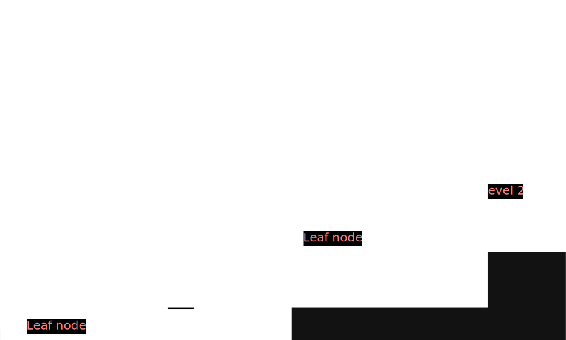

# Tree

### Fundamental
1) **Root :** Node with no parent e.g. 1.
2) **Edges :** Link from parent to child.
3) **Leaf node :** Node with no children.
4) **Siblings :** Children node of same parent.
5) **Ancestor :** from current node to parent node 
   - **E.G.:** take a node 8 
   - from that node to above node are Ancestor i.e. 1,2,4
6) **Descendant :** from current node to child node
    - **E.G.:** take a node 2
    - from that node to below node are Descendant i.e. 4, 8
7) **Level :**  The set of all nodes at given depth
8) **Depth of node :** Length of the path from **root to the node.**
    - Eg: depth of 8 is 3 because 1-2-4-8 
9) **Height of node :** length of the path from **that node to deepest node**
   - Eg: node 2 height is 2 because of left side have more node
10) **Height of tree :** is the maximum height amoung all the nodes in the tree
11) **Depth of tree :** is the maximum height amount all the node of tree

## Skew Tree
- If every node in tree has only one child ( except leaf node ) then we call such tree as skew trees.

